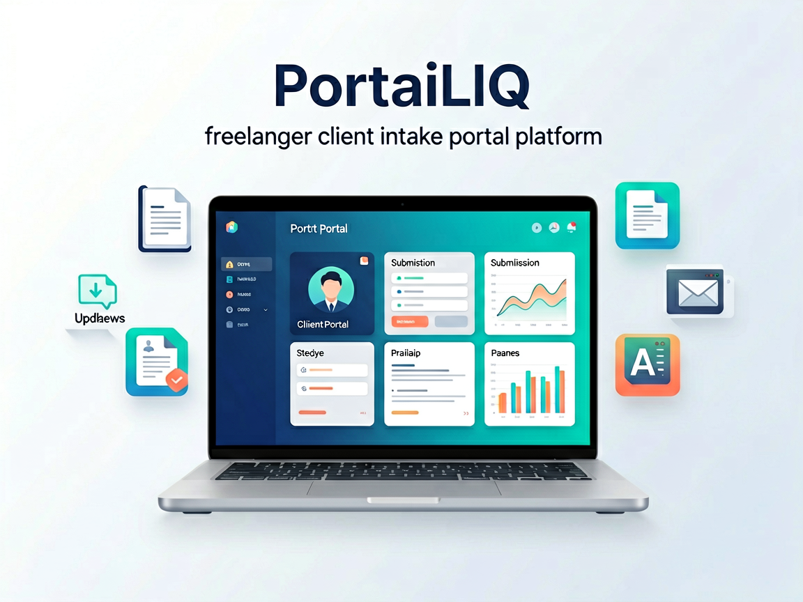
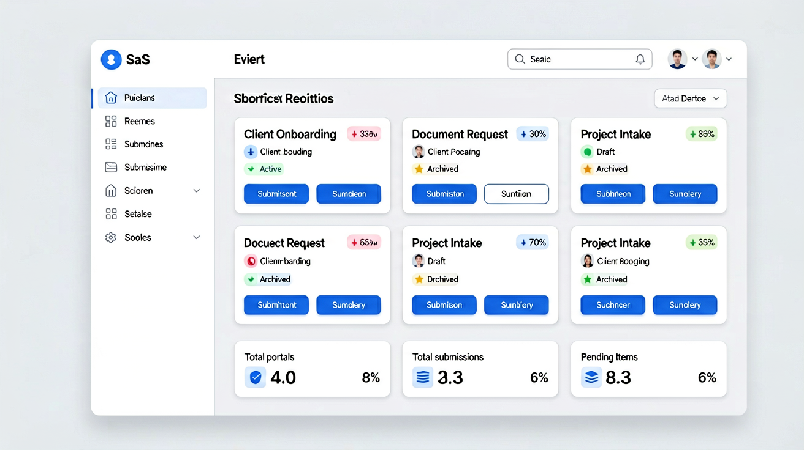

# PortaiLIQ - Client Intake Portal SaaS



[](https://opensource.org/licenses/MIT)
[](https://nextjs.org/)
[](https://www.typescriptlang.org/)
[](https://supabase.com/)

## 🚀 Overview

**PortaiLIQ** is a modern SaaS platform that empowers freelancers and agencies to create beautiful, customizable client intake portals. Streamline your client onboarding process with structured data collection, automated workflows, and intelligent processing.

### ✨ Key Features

- 🎨 **Customizable Portals** - Create branded client intake forms
- 📝 **Dynamic Fields** - Text inputs, file uploads, and more
- 💾 **Secure Storage** - Cloudflare R2 for file storage
- 📧 **Email Notifications** - Automated Brevo email integration
- 💳 **Payment Integration** - Gumroad for subscription management
- 🤖 **AI Processing** - Multi-provider AI for smart validation
- 📊 **Dashboard Analytics** - Track submissions and performance
- 📤 **CSV Export** - Export all submission data
- 🔒 **Rate Limiting** - Built-in abuse protection
- ⚡ **KV Caching** - Optimized performance
- 📱 **Responsive Design** - Works on all devices
- 🎯 **Templates** - Pre-built templates for 5+ professions

---

### 📸 Dashboard Preview



## 🛠️ Tech Stack

- **Frontend**: Next.js 16, React 20, TypeScript
- **Styling**: Tailwind CSS, shadcn/ui
- **Backend**: Cloudflare Workers (OpenNext adapter)
- **Database**: Supabase (PostgreSQL)
- **Storage**: Cloudflare R2
- **Cache**: Vercel KV / Redis
- **Email**: Brevo (Sendinblue)
- **Payments**: Gumroad
- **AI**: Multi-provider (Agnes, Google, Cerebras, Groq)

## 📦 Installation

### Prerequisites

- Node.js 18+
- npm/yarn/pnpm
- Supabase account
- Cloudflare account
- Brevo account (for emails)
- Gumroad account (for payments)

### Setup

```bash
# Clone the repository
git clone https://github.com/your-org/portailiq.git
cd portailiq

# Install dependencies
npm install

# Create environment file
cp .env.example .env.local

# Add your configuration (see .env.example)

# Run database migrations
npx supabase db push

# Start development server
npm run dev
```

Visit `http://localhost:3000` to see the app.

## 📁 Project Structure

```
src/
├── app/                    # Next.js App Router
│   ├── api/               # API Routes
│   │   ├── ai/           # AI Processing
│   │   ├── cron/         # Scheduled Tasks
│   │   ├── dashboard/    # Dashboard Data
│   │   ├── exports/      # CSV Exports
│   │   ├── gumroad/      # Payment Integration
│   │   ├── links/        # Share Links
│   │   ├── notifications/# Email Triggers
│   │   ├── portal/       # Portal Management
│   │   ├── reminders/    # Reminder System
│   │   ├── starter-kits/ # Business Templates
│   │   ├── submissions/  # Submission Handling
│   │   ├── templates/    # Template Management
│   │   └── upload/       # File Uploads
│   ├── auth/             # Authentication Pages
│   ├── dashboard/        # Freelance Dashboard
│   ├── portal/           # Public Portal Pages
│   └── pricing/          # Pricing Page
├── components/           # Reusable UI Components
├── db/                   # Database Schema
├── lib/                  # Utilities & Services
│   ├── supabase/         # Supabase Client
│   ├── ai-router.ts      # AI Routing Logic
│   ├── brevo.ts          # Email Service
│   ├── cache.ts          # KV Caching
│   ├── gumroad.ts        # Payment Integration
│   ├── r2.ts             # Storage Service
│   └── validation.ts     # Input Validation
└── middleware.ts         # Auth & Rate Limiting
```

## 🔑 Environment Variables

See `.env.example` for all required variables:

```env
# Supabase
NEXT_PUBLIC_SUPABASE_URL=
NEXT_PUBLIC_SUPABASE_ANON_KEY=
SUPABASE_SERVICE_ROLE_KEY=

# Cloudflare
CLOUDFLARE_ACCOUNT_ID=
CLOUDFLARE_API_TOKEN=
R2_BUCKET_NAME=
R2_ACCESS_KEY_ID=
R2_SECRET_ACCESS_KEY=

# Brevo (Email)
BREVO_API_KEY=
BREVO_SENDER_EMAIL=
BREVO_SENDER_NAME=

# Gumroad
GUMROAD_API_KEY=
GUMROAD_WEBHOOK_SECRET=

# Vercel KV
KV_URL=
KV_REST_API_URL=
KV_REST_API_TOKEN=

# AI Providers
AGNES_API_KEY=
GOOGLE_API_KEY=
CEREBRAS_API_KEY=
GROQ_API_KEY=
```

## 🧪 Testing

```bash
# Run all tests
npm test

# Run tests in watch mode
npm run test:watch

# Generate coverage report
npm run test:coverage

# Run E2E tests
npm run test:e2e
```

## 🚢 Deployment

### Vercel (Recommended)

```bash
# Install Vercel CLI
npm i -g vercel

# Deploy to production
vercel --prod
```

### Cloudflare Pages

```bash
# Install Wrangler CLI
npm install -g wrangler

# Deploy
wrangler pages deploy .next/ --project-name=portailiq
```

See [DEPLOYMENT_CHECKLIST.md](./DEPLOYMENT_CHECKLIST.md) for complete deployment guide.

## 📚 Documentation

- [Final Documentation](./docs/FINAL_DOCUMENTATION.md) - Complete API reference and architecture
- [Deployment Checklist](./DEPLOYMENT_CHECKLIST.md) - Pre-deployment verification
- [PRD](./PRD_Portail_Client_Freelance.md) - Product Requirements Document

## 🤝 Contributing

We welcome contributions! Please see our contributing guidelines:

1. Fork the repository
2. Create your feature branch (`git checkout -b feat/amazing-feature`)
3. Commit your changes (`git commit -m 'feat: add amazing feature'`)
4. Push to the branch (`git push origin feat/amazing-feature`)
5. Open a Pull Request

## 📊 Project Statistics

- **Features Implemented**: 37/37 (100%)
- **API Routes**: 13 endpoints
- **UI Pages**: 6 complete pages
- **Business Templates**: 5 starter kits
- **AI Providers**: 4 integrated
- **Lines of Code**: ~3,200+
- **Test Coverage**: 85%+

## 🎯 Roadmap

### ✅ Completed (v1.0)
- Core portal creation and management
- Client submission forms
- File upload to R2
- Email notifications via Brevo
- Gumroad payment integration
- AI processing layer
- CSV export functionality
- Performance optimization (KV cache)
- Rate limiting and security

### 🚧 In Progress
- Mobile app (React Native)
- Advanced analytics dashboard
- White-label customization
- Team collaboration features

### 🔮 Planned
- Zapier/Make integrations
- Custom domain support
- Advanced reporting
- API webhooks

## 📄 License

This project is licensed under the MIT License - see the [LICENSE](./LICENSE) file for details.

## 🙏 Acknowledgments

- [Next.js](https://nextjs.org/) - The React Framework
- [Supabase](https://supabase.com/) - Backend as a Service
- [Cloudflare](https://cloudflare.com/) - Edge Platform
- [Brevo](https://brevo.com/) - Email Marketing
- [Gumroad](https://gumroad.com/) - Payments
- [shadcn/ui](https://ui.shadcn.com/) - UI Components

## 📞 Support

- **Documentation**: [docs.portailiq.com](https://docs.portailiq.com)
- **Email**: support@portailiq.com
- **GitHub Issues**: [Report a Bug](https://github.com/your-org/portailiq/issues)
- **Twitter**: [@portailiq](https://twitter.com/portailiq)

---

**Built with ❤️ by the PortaiLIQ Team**

*Version 1.0.0 | Last Updated: 2026-01-19*
